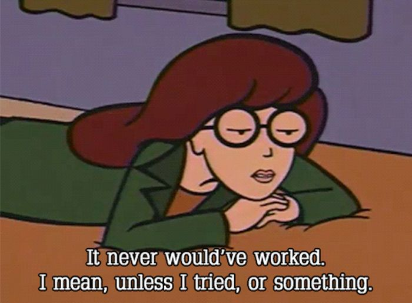

# Let's start!

Don't get confused with all the different text editors out there. Especially in the beginning it is not so much important which editor you use but more that you learn to code with one. Basically you can program with any text editor, be it the simpe __Notepad__, __Text Wrangler__, the developer favorite __Sublime Text__ or some licenced version like __Web Storm__. For now, we are going to work with __Sublime__. You can download it [here](http://www.sublimetext.com/2).

## The Basics
 
* Open your text editor
* Either you can open some of your self written code in the editor or you copy the code below

        
        <!-- This is the html part. While the CSS makes everything look pretty, the html gives our code the much neede structure -->
        

            

                
            

              <h1>This a Fanpage for the most badass girl ever</h1>
                <h3>(After you, of course)</h3>
        

* First thing you notice: Colors!
This is called *syntax highlightling* and is one very cool (and useful) feature. Depending which language you are using, your editor highlights tags, elements and attributes in different colors and faciliates working with code: 

	- Better Display of code structure
	- Easy to spot errors or missing bits
	- comments are "faded out"
	- Highlighting does not affect the text - for human eyes only
	- Improved code readability
	- Brace matching 

* Take a look at your code. Play around a bit: Remove a brace or an attribute. See if and what is changing. 
* **Now a little task for you:** Do you like the font of the text in the editor? It looks a bit oldschool, doesn't it? Try to change it into something a bit more modern!

### Something wrong?
Yes, we tricked you a little bit -  but it was for a good cause. You found out that in a text editor, opposite to text processing programs like *Microsoft Word*, it isn't possible to change the font of the text. That is one of the most promiment characteristics of an editor.

