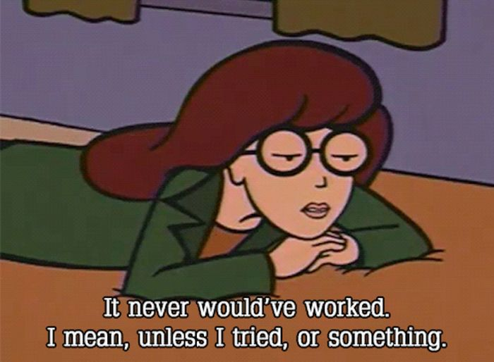

# A file is a file is a text: Introduction to working with text editors

To write cool and awesome code, you need **tools**. The most important tool is your **text editor**. A good text editor actually can take a lot of work off your hands. And best of all, it can help you reduce all these annoying errors in your code. So get ready for a whole lot of "texting"!

Structure: 

- What is a "file"?
- Plain Text vs.Code
- How to use your text editor?
  + What functions?
  + Tips 
- A little A to Z of files

## What is a file? 

#### Let's start with a simple question: What is a file? Let's brainstorm for a minute!
* Name different files 
  - Tip: To get you started, here are 3 file formats: _mp3_, _jpg_, _html_ ....
* For which purposes do we use files?
* What do have all files in common?
* Can you think of typical file attributes?

#### Great! Let's recap:

* Files are a collection of data that belongs together.
* We need a program to open our file, e.g. a videoplayer, an editor or an image proccessing software. Which program we use depends on the file format. Sometimes we already recognize files on their ending: .doc, .mp3, .html
* Files exist beyond the run-time of a program. They save content for repeated use. 

## Plain text vs code

When you work with your text editor , there is gonna be a lot of text - obviously. But not all text you write in your .html file will be displayed as text.

**For example**

    

      <h1>Das ist Text</h1>
        <a>
          
The words written here are the only text I'll be able to see later.

        </a>
    

Most the words above are not text but code. We can't just "read" it. Instead we need a program to decipher it's meaning. And the code itself is not the information it just contains information.
The same does not apply for **plain text**. 

    You can read this directly without decoding or translating it with a program. 
    The text transfers the information directly to you. That's why we call it plain text

Code is a way of transfering data in a certain format. Text, on the other hand, does not need a special format. 

### Something to do for you!

Let's find out, if our new found knowledge about **files** and **data** stuck. Check out the text snippets below. Can you tell which ones are plain text and which one are code? Bonus points if you find out which code!

#### Number 1

    

      

        

            
        

        

          <h4 class="gap_top_zero">Example Numer One</h4>
            
This is just an example how text can look like. And isn't the text written here, plain and pure? You can                 read it, right? Or are my words just a trick and this is an example of code? 

        

      

    

    
#### Number 2

    
    
### Number 3

    Uh, a lot of letters for a change that make actual sense when you read it. 
    I've written this sentence and that's all what is to it.
    No magic functions, no x oder z oder y and no cryptic code snippets. 
    This makes so much fun, I'll go on write another sencentece
    And another.
    I seem to be on a roll, because I really can't stop writing all these words down.
    
    
### Number 4 

    <script type="text/javascript">
    <!--
    // show page switch bullets
    var numerofslides = $("#carousel div.slide").size();
      if (numerofslides > 1) {
	      $("#pages").show();
    }

# Let's start!

Don't get confused with all the different text editors out there. Especially in the beginning it is not so much important which editor you use but more that you learn to code with one. Basically you can program with any text editor, be it the simpe __Notepad__, __Text Wrangler__, the developer favorite __Sublime Text__ or some licenced version like __Web Storm__. For now, we are going to work with __Sublime__. You can download it [here](http://www.sublimetext.com/2).

## The Basics
 
* Open your text editor
* Either you can open some of your self written code in the editor or you copy the code below

        
        
        

            

                
            

              <h1>This a Fanpage for the most badass girl ever</h1>
                <h3>(After you, of course)</h3>
        

